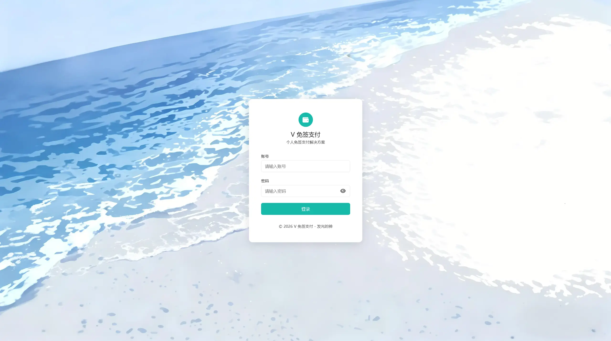
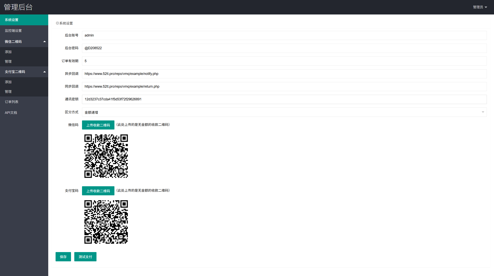
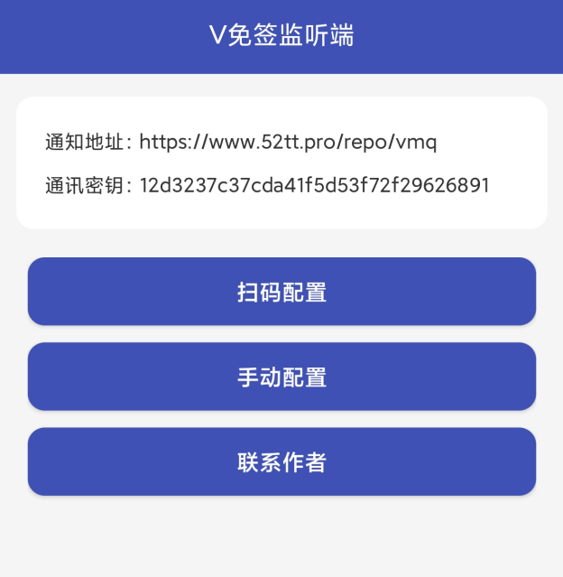

# V免签 (Vmq)

免签约支付回调服务端，基于 ThinkPHP 5.1。配合 V免签 Android 监控端使用——不需要企业资质，一个安卓手机挂着就能收微信/支付宝的付款回调。

     

## 功能

- 🛒 订单管理 — 创建订单、状态查询、超时自动关闭、手动补单
- 📱 APP 监控 — Android 端通过辅助功能监听微信/支付宝到账通知，实时推送到服务端
- 🔔 回调通知 — 支付到账后异步回调商户网站，签名参数可验证
- 📊 管理后台 — 仪表盘统计、二维码管理、订单列表、系统设置
- 🖼 二维码解析 — 上传收款码自动解析链接，支持按金额匹配不同二维码
- 📖 API 文档 — `/api.html` 在线文档，`public/example/` 有完整 PHP 接入示例
- 🛡 SSRF 防护 — CURL 出站请求前校验目标地址，屏蔽内网 IP 和非法协议
- 🔀 子目录部署 — 支持部署在任意路径前缀下（如 `/repo/vmq/`），不再限制根目录

## 预览

### 首页



### 后台



### APP 图标


### APP 主页




## 跟原版的区别

在原版 [szvone/vmqphp](https://github.com/szvone/vmqphp)（v1.12）基础上做了以下改动：

### 安全修复

| 问题 | 原版 | 修改后 |
|------|------|--------|
| SQL 注入 | `createOrder()` 用字符串拼接 INSERT | 参数化查询 `Db::execute(?, [bind])` |
| SSRF | `getCurl()` 无任何 URL 校验，跟随重定向 | `isSafeUrl()` 屏蔽内网 IP + 非 http/https 协议，`FOLLOWLOCATION = false` |
| XSS | `param` 参数原样入库出库 | `htmlspecialchars($param, ENT_QUOTES, 'UTF-8')` |
| 订单号注入 | `payId` 无过滤 | 正则 `preg_replace('/[^a-zA-Z0-9_\-]/', '', ...)` 限制 100 字符 |
| 存储型 XSS | 回调 URL 无过滤直接写库 | `FILTER_SANITIZE_URL` |
| 调试模式 | `app_debug = true`（生产环境暴露错误） | `app_debug = false` |
| 硬编码密钥 | `example/main.php` 等写死 `aa15188...` | `example/config.php` 动态从数据库读取 |
| 远程代码风险 | `checkUpdate()` 从 GitHub 拉版本信息 | 已删除 |
| CDN 供应链 | jQuery/Vue 从 CDN 加载 | 改为本地 `js/` 目录 |

### 功能改动

**子目录部署**

原版只能部署在域名根目录（`/`）。修改后 APK 和服务端支持任意路径前缀：
- `https://域名/repo/vmq/` ← 子目录
- `https://域名/` ← 根目录

后台监控设置页的配置二维码自动识别当前页面的 basePath，APK 扫码拿到完整地址。

**系统运行时间**

原版读 Linux `/proc/uptime`，Windows 下永远显示 0。改为数据库记录启动时间，跨平台通用。

**内置 APK**

添加了 `public/demo/v.apk`（5.56MB），后台监控设置页可直接下载。

**支付页重构**

`pay.html` 从头重写：inline SVG 图标、加载骨架屏、中英文切换、CDN 资源全部本地化。

**回调示例页**

`return.php` 从纯文本输出改为带动画的支付成功卡片页，配色匹配微信/支付宝品牌色。

**其他**

- 新增 `logout()` 登出接口
- 新增 `v.sql` 完整数据库文件（含 `startTime` 字段）
- 移除了危险的 `delAllOrder()` 一键清空订单
- `qr-code/test.php` 加了 `finally` 清理临时文件
- 数据库默认账号从 `root/root` 改为 `vmq/vmq@2085`

## 怎么工作的

```
客户扫码付钱（微信/支付宝）
        │
        ▼
V免签 Android APP 监听手机通知栏 → 检测到账
        │
        ▼
APP 推送收款数据 → 服务端 /appPush
        │
        ▼
服务端金额匹配 → 验签 → POST 回调商户 notify.php
        │
        ▼
商户网站验证回调签名 → 发货
```

APP 跑在安卓手机上，开辅助功能盯着微信和支付宝的通知栏。钱一到，APP 把金额、类型、时间推给服务端。服务端用这些匹配之前创建的订单，匹配上了就回调商户网站。

金额匹配靠一个巧妙的策略：每个订单的实际收款金额微调 ±0.01，保证同一时间段内金额不重复，APP 推送过来就能精确匹配到订单。

## 跑起来

### 环境

- PHP >= 5.6
- MySQL >= 5.5
- GD 库、cURL、MBString

### 部署

```bash
# 1. 装依赖
composer install

# 2. 导入 v.sql 到数据库

# 3. 编辑 config/database.php，填入数据库连接信息

# 4. 设置网站运行目录为 public/
# 宝塔面板：网站 → 设置 → 网站目录 → 运行目录选 /public，关闭防跨站
# 并设置默认文档第一行为 index.html

# 5. 配置伪静态（ThinkPHP 规则）
# 宝塔面板：伪静态直接选 thinkphp
```

Nginx 伪静态（手动配置时用）：
```nginx
location / {
    if (!-e $request_filename) {
        rewrite ^(.*)$ /index.php?s=/$1 last;
    }
}
```

Apache 伪静态：
```apache
<IfModule mod_rewrite.c>
RewriteEngine On
RewriteCond %{REQUEST_FILENAME} !-d
RewriteCond %{REQUEST_FILENAME} !-f
RewriteRule ^(.*)$ index.php?s=/$1 [QSA,PT,L]
</IfModule>
```

如果你把项目放在子目录下（如 `/repo/vmq/`），伪静态规则需要对应加上路径前缀。APK 配置时通过后台监控设置页的二维码扫码获取完整地址，自动适配。

### 登录后台

- 账号：`admin`
- 密码：`123456`

> 登录后立刻改密码。路径：后台 → 系统设置。

### 配置监控端 APP

1. 后台 → 系统设置 → 设好**通讯密钥**和**回调地址**
2. 后台 → 监控端设置 → 用 APP 扫描配置二维码（自动带上完整路径和密钥）
3. 或者直接下载 APK（页面里有下载按钮），手动填写服务端地址和密钥
4. 手机上开启辅助功能权限，保持 APP 后台运行

APP 定期发心跳到 `/appHeart`。超过 60 秒没心跳，服务端标记监控端离线——离线状态下创建订单会直接报错，防止客户付了钱收不到回调。

## 项目结构

```
vmq/
├── application/
│   ├── index/controller/Index.php    # API 控制器（订单、回调、APP 通信）
│   ├── admin/controller/Index.php    # 后台控制器（设置、订单管理、二维码）
│   └── service/QrcodeServer.php      # 二维码生成
├── config/
│   ├── app.php                       # 应用配置（版本号 1.0.0）
│   └── database.php                  # 数据库配置
├── public/                           # Web 根目录 ← 运行目录设这里
│   ├── index.html                    # 登录页
│   ├── main.html                     # 仪表盘
│   ├── api.html                      # API 文档
│   ├── admin/                        # 后台子页面
│   │   ├── setting.html              # 系统设置
│   │   ├── jk.html                   # 监控端设置（含配置二维码）
│   │   └── orderlist.html            # 订单管理
│   ├── payPage/pay.html              # 扫码支付页
│   ├── example/                      # 商户接入示例
│   │   ├── config.php                # 配置（自动读数据库密钥）
│   │   ├── main.php                  # 创建订单
│   │   ├── notify.php                # 异步回调处理
│   │   └── return.php                # 同步跳转处理
│   ├── demo/v.apk                    # 监控端 APP（修改版）
│   ├── layui/                        # LayUI 前端
│   ├── qr-code/                      # 二维码解析库（ZXing PHP 移植）
│   └── js/llqrcode.js                # 前端二维码解析
├── route/route.php                   # 路由定义
├── thinkphp/                         # ThinkPHP 5.1 框架
├── vendor/                           # Composer 依赖
├── runtime/                          # 日志、缓存
├── v.sql                             # 数据库文件
└── README.md
```

## API 接口

### 商户端（你的网站调用）

| 路由 | 方法 | 说明 |
|------|------|------|
| `createOrder` | GET/POST | 创建订单 |
| `getOrder` | GET/POST | 查订单详情 |
| `checkOrder` | GET/POST | 查支付状态，返回带签名跳转 URL |
| `closeOrder` | GET/POST | 关闭未支付订单（需签名） |
| `getState` | GET/POST | 查监控端在线状态（需签名） |
| `closeEndOrder` | GET/POST | 批量关闭过期订单（配定时任务） |

### 监控端（APP 专用）

| 路由 | 说明 |
|------|------|
| `appHeart` | 心跳保活 |
| `appPush` | 推送收款数据 |

### 签名规则

```
sign = md5(参数拼接 + 通讯密钥)
```

通讯密钥在后台系统设置里配置。不同接口的拼接方式见 `/api.html`。

### 创建订单

```
GET/POST /createOrder
```

| 参数 | 必填 | 说明 |
|------|------|------|
| `payId` | 是 | 商户订单号，`[a-zA-Z0-9_-]`，最长 100 位 |
| `type` | 是 | 1=微信 2=支付宝 |
| `price` | 是 | 金额，> 0 |
| `sign` | 是 | `md5(payId + param + type + price + 通讯密钥)` |
| `param` | 否 | 自定义参数，最长 500，自动 XSS 过滤 |
| `isHtml` | 否 | 0=返回 JSON，1=跳转支付页 |
| `notifyUrl` | 否 | 异步回调地址 |
| `returnUrl` | 否 | 同步跳转地址 |

## 金额区分机制

同金额订单并发时 APP 无法区分哪笔到账对应哪个订单。系统在 `tmp_price` 表用 `INSERT IGNORE` 做金额占位，如果同金额已存在则自动微调：

- `payQf=1`：金额 +0.01（3.00 → 3.01）
- `payQf=2`：金额 -0.01（3.00 → 2.99）

最多重试 10 次。这样每笔订单的实际收款金额都是唯一的，APP 推送过来精确匹配。

## 订单状态

| 状态 | 含义 |
|------|------|
| `0` | 待支付 |
| `1` | 已支付 |
| `2` | 已支付但回调商户失败 |
| `-1` | 已过期/已关闭 |

## 安全措施

| 场景 | 做法 |
|------|------|
| SQL 注入 | 全 PDO 参数化查询（修复原版字符串拼接） |
| SSRF | CURL 前校验目标 IP，屏蔽 10.x / 172.16-31.x / 192.168.x / 127.x / 0.x / localhost / IPv6 环回 |
| 协议限制 | 只允许 http/https，禁止 `file://`、`gopher://` 等 |
| 重定向攻击 | CURL `FOLLOWLOCATION = false`，不跟随跳转 |
| XSS | 商户 `param` 参数 `htmlspecialchars(ENT_QUOTES)` |
| 订单号注入 | 正则过滤，只允许 `[a-zA-Z0-9_-]`，截断 100 字符 |
| 回调 URL | `FILTER_SANITIZE_URL` 过滤后写库 |
| 生产安全 | `app_debug = false`，不暴露错误详情 |
| 接口调用 | MD5 签名，密钥可配 |
| 密码存储 | 明文（后台内部使用，非对外接口） |

## 定时任务

```bash
# 每分钟自动关闭超时订单
* * * * * curl -s "http://你的域名/closeEndOrder"
```

## 常见问题

**打开网站提示"默认文档未设定"？** 宝塔 → 网站 → 设置 → 默认文档，`index.html` 拖到第一行。

**打开网站提示"运行目录未设定"？** 网站运行目录改成 `public/`，关闭防跨站。

**监控端显示离线？** APP 是否在运行、辅助功能是否开启、服务端地址和密钥是否正确。

**付了钱没回调？** 查 `runtime/log/`。确认商户回调地址外网可达。

**创建订单提示"监控端状态异常"？** 监控端离线超过 60 秒，检查手机上 APP 状态。

**部署在子目录下 APP 连不上？** 去后台 → 监控端设置 → 重新扫配置二维码，二维码里已经带了当前页面的完整路径。

## 免责声明

本软件仅供学习研究。严禁用于违法用途。使用本软件对接支付产生的一切法律责任由使用者自行承担。

## 许可证

Apache-2.0 · 基于 [szvone/vmqphp](https://github.com/szvone/vmqphp) 修改
